LangChain : powered by LLMs!!
Open-source framework that helps in building LLM based applications. It provides modular components and end-to-end tools that help developers build complex AI applications such as chatbots, q-a systems, etc.

Supports all major LLMs
Simplifies developing LLM based applications
Integrations available for all major tools
Open source / Free / Actively developed
Supports all major GEnAI use cases

# GenAI :
refers to models and systems that create new content - text, image, audio, code, video, etc.

# Types of GenAI :
1. LLM - generate text(often code)
2. Diffusion Models - used for img/audio generation
3. GAN - used for images and sometimes audio
4. Autoregressive vs Autoencoding vs Energy-based - other modelling paradigms -- influence how things are generated..

## LLM :
# Model architecture families -
## Decoder only (autoregressive)
 - Predicts that next token given previous tokens.
 - Great for text generation & conversational use.
 - GPT, Llama..
## Encoder-Decoder (seq2seq) - 
 - Encoder processes i/p; Decoder generates o/p conditioned on encoder o/p.
 - Used for translation, summarization, etc
 - Encoder only - used for classification / embeddings(BERT fam) -- not primarily generative.

### tokens 
 - models don't use words -- tokens (word, subword, part of word) -- tokenizer
 
 ### Attention 
  - attention mechanism lets the model decide which parts of i/p are relevant when producing each o/p token.
  - # self-attention
		- every token can attend to other tokens; this is key to modelling long-range dependencies (coreference, long contexts)
   - # intuition 
		- when generating word "it" model uses attention to decide what "it" refers earlier in text.

### LangChain :

1. Fundamentals
		a. What is LangChain
		b. LangChain Components
		c. Models
		d. Prompts
		e. Parsing Output
		f. Runnables and LCEL
		g. Chains
		h. Memory

2. RAG
		a. Doc Loaders
		b. Text Splitters
		c. Embeddings
		d. Vector Stores
		e. Retrievers
		f. Building RAG application

3. Agents
		a. Tools and Toolkits
		b. Tool Calling
		c. Building an AI agent

3 versions
.1 , .2, .3  -- updated

Why need LangChain :

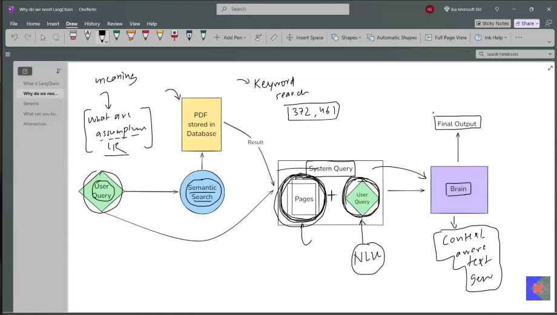

problem -
algebra doubt
----- or -----
pg no 1,2 

Semantic Search :

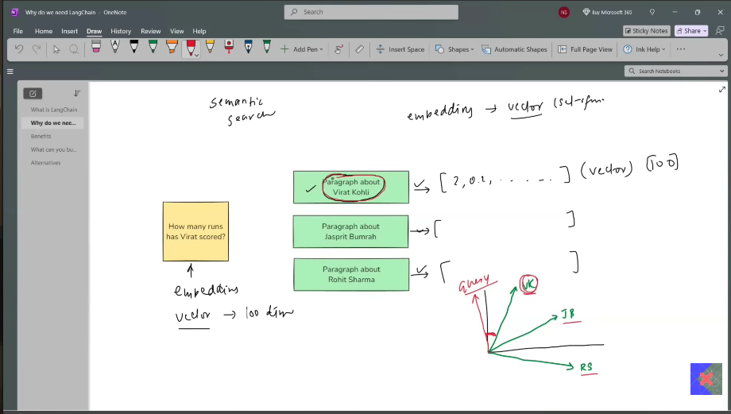

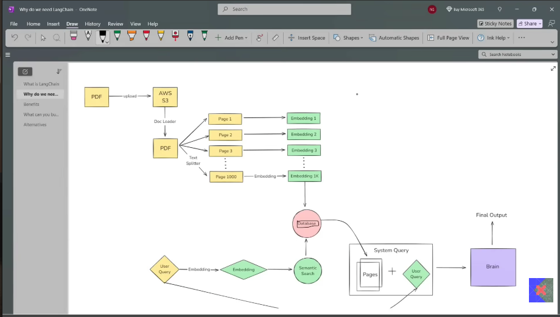

## Challenges :
Brain development (LLM)
APIs - - -
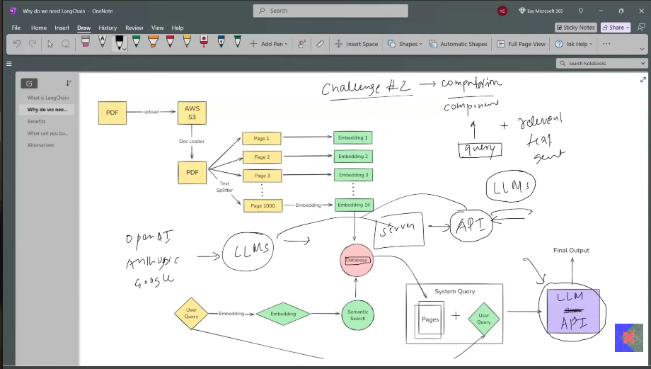

Chains - pipeline formation (series of tasks)
Model Agnostic Developement (when change the API or Model used just one change)
Complete Ecosystem
Memory and state handling

What can be build ?
Conversational Chatbots
AI knowledge Assistants
AI Agents
Workflow Automation
Summarization / Research Helpers

# Langchain Components :
- Models 
- Prompts
- Chains 
- Memory 
- Indexes
- Agents 

Models - core interfaces through which you interact with AI models

NLP (chatbot) -- NLU + Reply - - - LLMs 
New issue as LLMs trained on whole internet data (100GB)

solved using APIs -- memory issue

[ Implementation ] - 

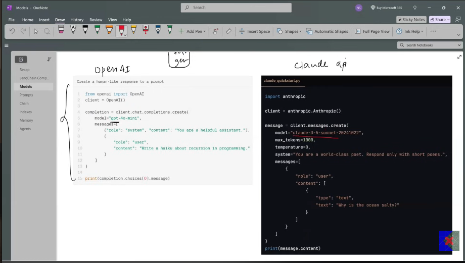

2 different kinds of code!!

LangChain identified this prblm :
No need to change the code -- LangChain is the interface

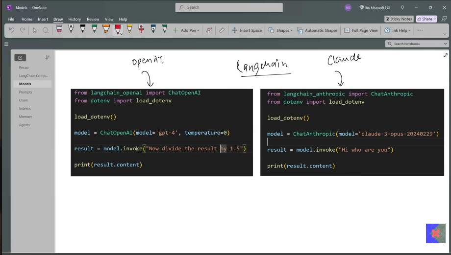

LangChains :
Language Model
Embedding Model

LLM -> input -> prompt
input -> chatgpt [what is ...]

Chains :
We can build pipelines with the help of chains

input(Eng text) -- Hindi Summarizer (100)

------ PIPELINE ------
i/p -> LLM -> translator -> LLM -> summary
 ----- > > Sequential chain(simple)
--> Automatically make one stage o/p as i/p for another stage!!
No need to write manual code for it....

Indexes :
connect your application to external knowledge - like PDFs, websites, datasets

Doc Loader
Text splitter
Vector Store
Retrievals

build LLM + which have external Knowledge
Chunking - divide in pages ... Embeddings ... database store

Memory -> LLM API calls are stateless...

Who is Narendra Modi -> LLM API -> description
How old is he -> LLM API -> don't have access to personal data

ConversationBufferMemory - stores a transcript of recent msg, great for short chats but can grow large quickly...
ConversationBufferWindowMemory - only keeps the last N interactions to avoid excessive token usage.
Summarizer-Based Memory - Periodically summarizes older chat segments to keep a condensed memory footprint.
Custom Memory - For advanced use cases, you can store specialised state (e.g. the user's preferences or key facts about them) in a custom memory class.

Agents :
with the help of this can make AI Agents
-- LLM (NLU + Textgram) -> Chatbot -> Travel Website (Shimla or Manali) || AI Agent --> Which is the cheapest flight -- give info ---> can book the flight ticket as well!!!

Reasoning capabilities + access to tools>>>>>>>>>>>

Model Components in LangChain -- crucial part of framework, designed to facilitate interactions with various # Language models & # Embedding models.

It abstracts the complexity of working directly with different LLMs, chat models, and embedding models, providing a uniform interface to communicate with them. This makes it easier to build applications that rely on AI-generated text, text embeddings for similarity search, and retrieval-augmented generation (RAG).

Language Models -- LLMs & Chat Models
### text -> AI Models -> Text return (language model)
Embedding Models -- Series of numbers (vectors)...
help in semantic search -- RAG-based model

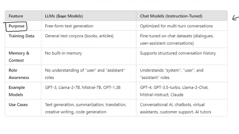

Setup :
new folder
open it in vs code
create new venv --- python -m venv venv
activate venv venv\Scripts\Activate
create requirements.txt
Install pkg from requirements.txt --- pip install -r requirements.txt
verify LangChain installation

Libraries :
-> Langchain core
langchain
langchain-core

-> OpenAI Integration
langchain-openai
openai

-> Anthropic Integration
langchain-anthropic

-> Google Gemini(PaLM) Integration
langchain-google-genai
google-generativeai

-> Hugging face Integration
langchain-huggingface
transformers
huggingface-hub

-> Environment Variable Management
python-dotenv

-> ML Utilities
numpy
scikit-learn

Open-source models :
allows customization -- perform fine-tuning
Model --> internet -> can dwnld -> deploy -> can perform tasks

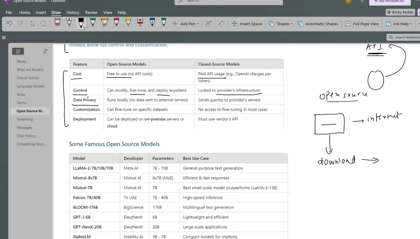

Llama -- fb 

Where to find them ?
HuggingFace -- Largest repo for open-source models

Open-source Models :
1. Using HF Inference API
2. Running Locally

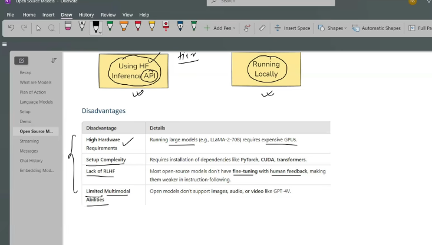

Mostly can work with text-API, not in Image-APIs.

Temperature : 
0 to 2 (range)

temperature = 0 -- same input and same output
if value increased --> slight change (creativity improved)!!

###### Video-6

Prompts :
Input instructions or queries given to a model to guide its output.

1. Text-based prompts
2. Multi-modal prompt (sending image then ask questions)

# a. Static Prompts 
# b. Dynamic Prompts

Research Assitant -
Summarize the attention is all you need paper in simple fashion

Dynamic Prompt : PromptTemplate !!

A prompt template in LangChain is a structured way to create prompts dynamically by inserting variables into predefined template. Instead of harcoding prompts, PromptTemplate allows you to define placeholders that can be filled in at runtime with different inputs.

-- Makes reusable, flexible, easy to manage -- especially when working with dynamic user inputs or automated workflows.

Why use PromptTemplate over f strings ?
-> Default validation
-> Reusable
-> Langchain Ecosystem

Types of Messages in LangChain :
System msg
Human msg
AI msg

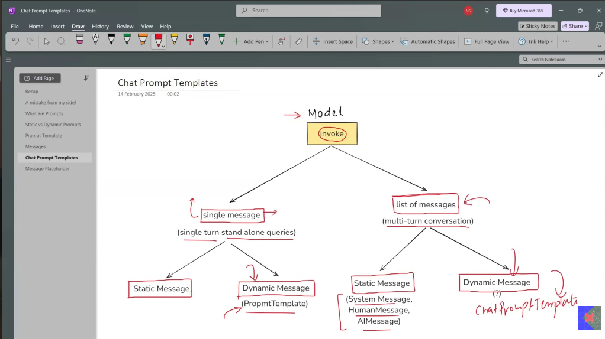

system msg -> dynamic
[You are a helpful {domain} expert]

Human msg -> dynamic
[Explain about {topic}]

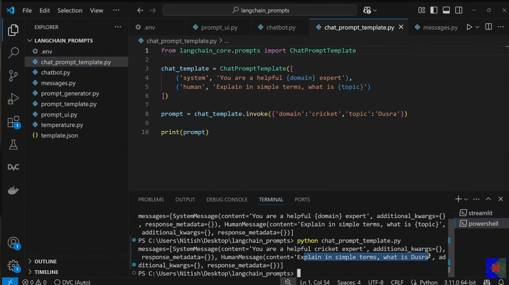

Msg Placeholder :
is a special placeholder used inside a ChatPromptTemplate to dynamically insert chat history or a list of msg at runtime.

### Video-7
## Structured Output

In LangChain, structured output refers to practice of having language models return responses in a well-defined data format (JSON), rather than free-form text.
This makes model output easier to parse & work with programmatically.

Use cases :
-> Data Extraction
-> API building
-> Agents

Agents -- can work using tools
Chatbots -- can give descp how to do it

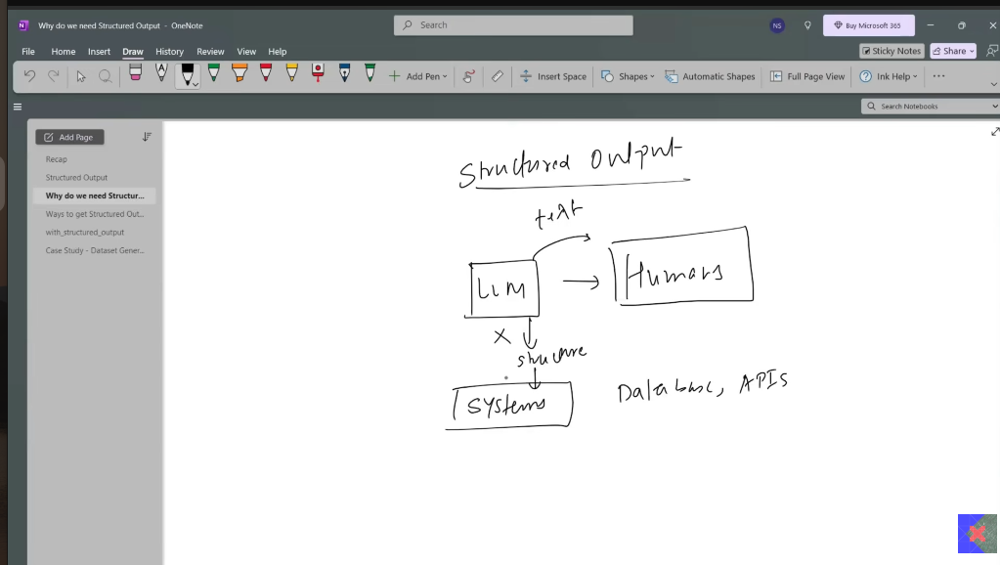

LLMs:
[can] -- with_structured_output
[cannot] -- output parsers

model_invoke :
1. Typed Dict
2. Pydantic
3. json_schema

Typed Dictionary:
is a way to define a dict in python where you specify what keys and values should exist. It helps to ensure that your dict follows specific structure.
 
# Why use TypedDict ? (konsa value kis datatype ka hona chaie)
- It tells python what keys are required & what types of values they should have.
- It doesn't validate data at runtime (just helps with type hints for better coding)

-- Single TypedDict
-- Annotated TypedDict
-- Literal
-- More complex -> with pros & cons

# Pydantic
-- It is a data validation & data parsing library for python. It ensures that data you work with is correct, structured and type-safe.

Basic ex
Default values
Optional fields
Coerce
Builtin validation
Field function -> default values, contraints, description, regex
Return pydantic object -> convert to json/dict

## JSON schema
- when using multiple languages in a single project!!

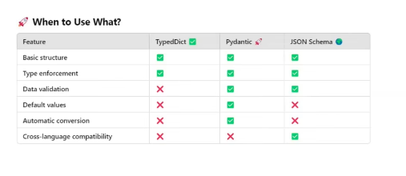

## Video - 8

Output parsers :
Help convert raw LLM responses into structured formats like JSON, CSV, Pydantic models and more.
Ensures consistency, validation and ease of use in applications.

1. string output parser
2. json output parser
3. structured output parser
4. parser output parser

-- StrOutputParser
is simplest output parser in LangChain, used to parse output of LLM & return it as a plain string.

topic -> LLM -> [detailed report] -> LLM -> summarizes in 5 lines 

Structured output parser --
an output parser in LangChain that helps extract structured JSON data from LLM responses based on predefined field schemas.
It works by defining a list of fields (ResponseSchema) that the model should return, ensuring output follows a structured format..

# PydanticOutputParser 
a structured output parser in LangChain that uses Pydantic models to enforce schema validation when processing LLM responses.

Why use ?
- Strict schema enforcement -- ensures that LLM responses follow a well-defined structure.
- Type safety - Automatically converts LLM outputs into Python objects.
- Easy Validation -- Uses pydantic's built-in validation to catch incorrect or missing data.
- Seamless Integration -- Works well with other LangChain components. 

## Video - 9
## Chains
LangChain 
-- Modals
-- Prompts
-- Structured Output
		-- Output parsers
		-- 
-- Chains
		-- Runnable

What and Why ?

Prompt -> LLM -> Output
with the help of chains u can create pipelines

Chains -- 
1. Sequential
2. Parallel
3. Conditional

## Video - 10
## Runnables in LangChain

Why exist ?
2022 -- chatgpt release -- API -- LLM based app

LangChain -- LLMs powerful
-> Chatbots
-> Pdf readers

OpenAI - building LLM
Anthropic - building LLM
Google - building LLM

framework -- openAI - Google - Anthropic

pdf read --
-> load (document loader) -> split -> embedding generate -> vector (store) -> retrieval -> LLM -> parse (parser)

breakdown -- helper classes

-> user -> topic -> prompt => LLM display
-> pdf reader -> 

Components -- 
-> LLM applications
-- common things -- [prompts -> LLM]

Manually -- it's done..
What if -- it's automate..

query -> vector db -> relevant doc -> prompt -- send to LLM

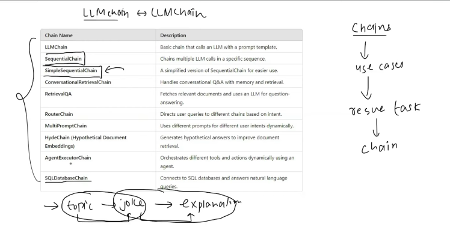

Problem -- developers made too many chains

-> codebase problematic - heavy
-> AI engineers (new) difficult to understand

LLM Prompt -- LLM Chain (to create compatibility)
For a specific usecase developers have to create manual standard components

To connect components -- use Runnables

## Runnables -- unit of work
 -> input 
 -> process
 -> output

Common Interface
	-> invoke()
	-> batch() -- multiple i/p multiple o/p
	-> stream()

-> connect

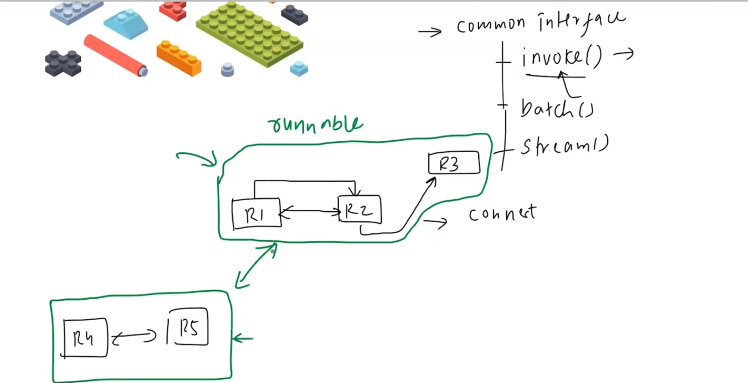

LAGO BLOCKS - each block has its own usecase

What -- How 

We get results in form of dict by LLM!!

### chain - joke generate topic wise
### joke -> chain 2 -> explanation

- prompt  -- format
- llm  -- predict
- parsers  -- parse
- retrieval  --

standardize component ------ INVOKE()

Technique used is Runnable!!!!

Runnables type :
1. Task specific runnables
	a. These are the core Langchain components that have been converted into Runnables so they can be used in pipelines.
	
	b. Purpose - to perform task-specific operations like LLM calls, prompting, retrieval, etc.

	c. Examples-

 -- ChatOpenAI - Runs LLM model
 -- PromptTemplate - Formats prompts dynamically
 -- Retriever - retrieves relevant documents

2. Runnable Primitives
	a. These are the fundemental building blocks for structuring execution logic in AI workflows.

	b. They help orchestrate execution by defining how different Runnables interact (sequentially, parallely, conditionally..)

	c. Examples-

	-- RunnableSequence -> Runs steps in order ( | operator)
	-- RunnableParallel -> Runs multiple steps simultaneously
	-- RunnableMap -> Maps same i/p across multiple functions
	-- RunnableBranch -> Implements conditional execution (if-else logic)
	-- RunnableLambda -> Wraps custom python functions into Runnables
	-- RunnablePassthrough -> Just forwards i/p as o/p (acts as a placeholder)

## RunnableSequence :

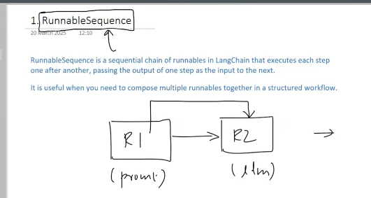
-------------------------------------------------------
from langchain_openai import ChatOpenAI
from langchain_core.prompts import PromptTemplate
from langchain_core.output_parsers import StrOutputParser
from dotenv import load_dotenv
from langchain.schema.runnable import RunnableSequence

load_dotenv()

prompt1 = PromptTemplate(
    template='Write a joke about {topic}',
    input_variables=['topic']
)

model = ChatOpenAI()

parser = StrOutputParser()

prompt2 = PromptTemplate(
    template='Explain the following joke - {text}',
    input_variables=['text']
)

chain = RunnableSequence(prompt1, model, parser, prompt2, model, parser)

print(chain.invoke({'topic':'AI'}))
-------------------------------------------------------

### RunnableParallel :

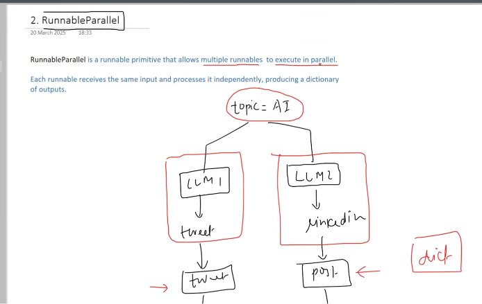
-------------------------------------------------------
from langchain_openai import ChatOpenAI
from langchain_core.prompts import PromptTemplate
from langchain_core.output_parsers import StrOutputParser
from dotenv import load_dotenv
from langchain.schema.runnable import RunnableSequence, RunnableParallel

load_dotenv()

prompt1 = PromptTemplate(
    template='Generate a tweet about {topic}',
    input_variables=['topic']
)

prompt2 = PromptTemplate(
    template='Generate a Linkedin post about {topic}',
    input_variables=['topic']
)

model = ChatOpenAI()

parser = StrOutputParser()

parallel_chain = RunnableParallel({
    'tweet': RunnableSequence(prompt1, model, parser),
    'linkedin': RunnableSequence(prompt2, model, parser)
})

result = parallel_chain.invoke({'topic':'AI'})

print(result['tweet'])
print(result['linkedin'])
-------------------------------------------------------

### RunnablePassThrough

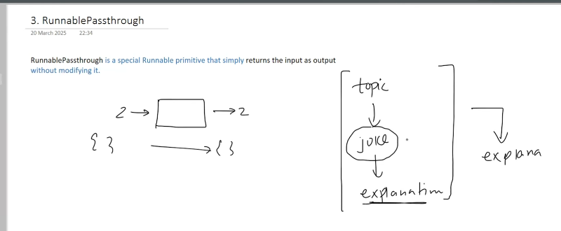

joke_gen_chain 

-------------------------------------------------------
prompt -> LLM -> parser -- runnablePassThrough -- joke print
						-- prompt2 -> llm -> parser -- explanation

from langchain_openai import ChatOpenAI
from langchain_core.prompts import PromptTemplate
from langchain_core.output_parsers import StrOutputParser
from dotenv import load_dotenv
from langchain.schema.runnable import RunnableSequence, RunnableParallel, RunnablePassthrough

load_dotenv()

prompt1 = PromptTemplate(
    template='Write a joke about {topic}',
    input_variables=['topic']
)

model = ChatOpenAI()

parser = StrOutputParser()

prompt2 = PromptTemplate(
    template='Explain the following joke - {text}',
    input_variables=['text']
)

joke_gen_chain = RunnableSequence(prompt1, model, parser)

parallel_chain = RunnableParallel({
    'joke': RunnablePassthrough(),
    'explanation': RunnableSequence(prompt2, model, parser)
})

final_chain = RunnableSequence(joke_gen_chain, parallel_chain)

print(final_chain.invoke({'topic':'cricket'}))
-------------------------------------------------------

### RunnableLambda -

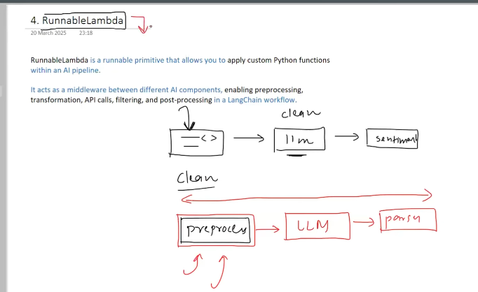
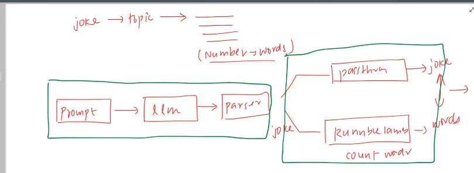

-------------------------------------------------------
from langchain_openai import ChatOpenAI
from langchain_core.prompts import PromptTemplate
from langchain_core.output_parsers import StrOutputParser
from dotenv import load_dotenv
from langchain.schema.runnable import RunnableSequence, RunnableLambda, RunnablePassthrough, RunnableParallel

load_dotenv()

def word_count(text):
    return len(text.split())

prompt = PromptTemplate(
    template='Write a joke about {topic}',
    input_variables=['topic']
)

model = ChatOpenAI()

parser = StrOutputParser()

joke_gen_chain = RunnableSequence(prompt, model, parser)

parallel_chain = RunnableParallel({
    'joke': RunnablePassthrough(),
    'word_count': RunnableLambda(word_count)
})

final_chain = RunnableSequence(joke_gen_chain, parallel_chain)

result = final_chain.invoke({'topic':'AI'})

final_result = """{} \n word count - {}""".format(result['joke'], result['word_count'])

print(final_result)
-------------------------------------------------------

### RunnableBranch -

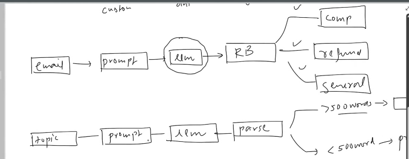

-------------------------------------------------------

from langchain_openai import ChatOpenAI
from langchain_core.prompts import PromptTemplate
from langchain_core.output_parsers import StrOutputParser
from dotenv import load_dotenv
from langchain.schema.runnable import RunnableSequence, RunnableParallel, RunnablePassthrough, RunnableBranch, RunnableLambda

load_dotenv()

prompt1 = PromptTemplate(
    template='Write a detailed report on {topic}',
    input_variables=['topic']
)

prompt2 = PromptTemplate(
    template='Summarize the following text \n {text}',
    input_variables=['text']
)

model = ChatOpenAI()

parser = StrOutputParser()

report_gen_chain = prompt1 | model | parser

branch_chain = RunnableBranch(
    (lambda x: len(x.split())>300, prompt2 | model | parser),
    RunnablePassthrough()
)

final_chain = RunnableSequence(report_gen_chain, branch_chain)

print(final_chain.invoke({'topic':'Russia vs Ukraine'}))
-------------------------------------------------------

declarative way -- Might come!!

